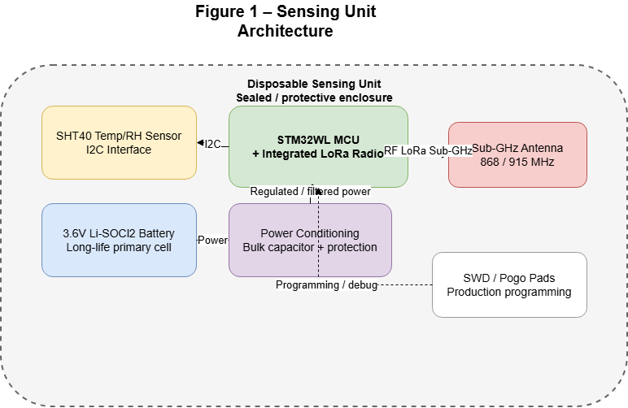
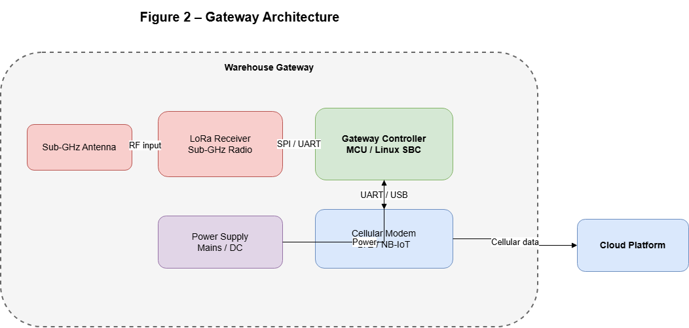
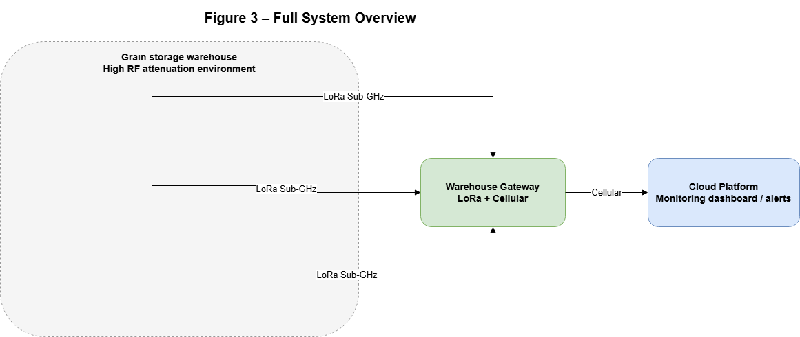

# GrainSense LoRa Monitoring System


GrainSense is a system - level prototype for long - term environmental monitoring inside grain storage piles.  
It combines low-power embedded firmware, a compact uplink protocol, and a gateway - side validation and simulation pipeline.  
Originally developed as an Electrical Engineering coursework project, it was extended to reflect how a field-deployable IoT product would be structured and reasoned about.

## Why This Project Matters

From an engineering standpoint, this repository is a useful slice of a real wireless sensing product:

- **Harsh RF environment** — grain is lossy and time-varying; link margin and packet loss are first-class design inputs, not afterthoughts.
- **Severe battery constraints** — nodes must run for years with sparse reporting; every wake-up, sensor on-time, and airtime has a cost.
- **System-level tradeoffs** — range, data rate, duty cycle, regulatory limits, and cloud semantics must stay coherent across firmware, air interface, and gateway policy.
- **Real-world IoT challenges** — identity, multi-site filtering, integrity checks, and operational observability (e.g. link quality) mirror what production teams solve daily.

## Problem Background

Grain storage quality depends heavily on internal temperature and moisture conditions. Poor visibility inside large grain piles can lead to:

- Localized heating and moisture accumulation
- Mold and quality degradation
- Potential self-heating and combustion risk

External measurements are often insufficient because internal hotspots can develop far from silo walls.  
A buried sensing approach addresses this, but wireless communication becomes difficult because grain introduces significant RF attenuation, especially as moisture content changes.

## System Architecture







**Sensing Unit -> LoRa/Sub-GHz -> Gateway -> Cellular -> Cloud**

- **Sensing Unit (inside grain pile)**  
  Disposable STM32WL-based node with SHT40 sensor. Wakes every 12 hours, samples temperature/humidity, transmits a compact packet, then returns to deep sleep.

- **LoRa/Sub-GHz Air Link**  
  Long-range, low-data-rate uplink optimized for high attenuation environments and multi-year battery life.

- **Warehouse Gateway**  
  Receives packets, validates identity and integrity (`unit_id`, `gateway_id`, `warehouse_id`, CRC), and filters unauthorized traffic.

- **Cellular Backhaul**  
  Gateway forwards validated data to cloud services over LTE-M/NB-IoT style connectivity.

- **Cloud Layer**  
  Stores telemetry for trends, alerts, and operational decisions (simulated in this repository via CSV logging).

## Key Features

- Ultra-low-power STM32WL-based sensing node firmware, structured for multi-year operation
- Factory-grade environmental sensing via SHT40 (temperature and humidity over I²C)
- LoRa / Sub-GHz uplink model aligned with long-range, low-throughput telemetry
- Two-year battery design posture: documented duty cycle, deep sleep, and bounded retries (see `docs/power_budget.md`)
- Compact binary protocol: `unit_id`, `gateway_id`, `warehouse_id`, sequence, sensors, battery, retry index, and CRC
- Gateway-side validation: CRC, identity, and whitelist policy before any “cloud” handoff
- Python gateway simulator for repeatable integration tests without hardware in the loop
- Adaptive RF link-quality monitoring (RSSI / SNR) with actionable recommendations
- Structured telemetry logging pipeline (CSV-based) for accepted uplinks

## What Makes This Project Unique

- **Embedded plus systems** — firmware, radio framing, and gateway policy are designed as one coherent story, not isolated demos.
- **RF-aware, not lab-ideal** — attenuation and margin are treated as constraints that drive protocol and simulator behavior.
- **Gateway intelligence** — validation and link analysis live where operational decisions naturally occur (at the edge).
- **Honest tradeoffs** — power, airtime, retries, and identity fields are discussed with engineering specificity rather than buzzwords.
- **Interview-ready artifacts** — clear module boundaries, a defined wire format, and documentation that supports deep technical discussion.

## Repository Structure

```text
grain-sense-lora-monitoring/
├── README.md
├── docs/
│   ├── design_document.md
│   ├── power_budget.md
│   ├── protocol_design.md
│   ├── bom.md
│   └── diagrams/
├── firmware/
│   ├── Core/
│   ├── drivers/
│   └── app/
├── gateway_simulator/
│   ├── main.py
│   ├── packet_parser.py
│   ├── link_quality.py
│   ├── authorized_units.json
│   └── received_packets_log.csv
├── protocol/
│   └── packet_format.md
└── assets/
    └── diagrams/
```

## Communication Protocol

The uplink uses a compact packed structure (`GrainUplinkPacket_t`, 19 bytes on the wire) to minimize airtime and energy consumption.

### Main Fields and Purpose

- **`unit_id`**: identifies the physical sensing node
- **`gateway_id`**: ensures packet association with the intended gateway
- **`warehouse_id`**: supports multi-site separation and filtering
- **`sequence_number`**: enables ordering and duplicate detection
- **`temperature_c_x100`, `humidity_rh_x100`**: environmental measurements
- **`battery_mv`**: battery health tracking
- **`retry_count`**: indicates retransmission index
- **`crc`**: payload integrity check

### Why CRC and Retry Matter

- **CRC** protects against corrupted RF frames in noisy/high-loss environments.
- **Retry logic** improves delivery probability, but retries are bounded to avoid draining the battery budget.

## Power Management Strategy

Battery life is achieved through aggressive duty cycling and disciplined peripheral usage:

- The node spends most of its life in deep sleep (STOP2-style retention mode)
- A single measurement and transmission cycle runs every 12 hours
- Active time is limited to sensor acquisition, framing, and radio events
- Retries are bounded so worst-case energy stays predictable

Together, these choices support a credible multi-year deployment narrative under the documented assumptions (`docs/power_budget.md`).

## RF Design Considerations

Grain is a difficult RF medium: bulk density and moisture shift path loss and multipath, reducing margin and increasing loss bursts.

### Why Sub-GHz LoRa (instead of Wi-Fi/BLE)

- Better propagation through obstructed environments
- Much lower average energy per reporting cycle
- Suitable for low data rates and sparse telemetry intervals

### Tradeoff

- Lower data rate and higher latency compared to short-range high-throughput protocols
- Higher reliability potential in exchange for limited payload volume and duty-cycle planning

## Advanced Feature — Link Quality Monitoring

The gateway simulator includes adaptive RF analysis (`gateway_simulator/link_quality.py`):

- Simulates realistic **RSSI** and **SNR** per packet
- Classifies link quality into:
  - `GOOD`
  - `WEAK`
  - `CRITICAL`
- Generates adaptive recommendations:
  - Increase spreading factor
  - Increase TX power (within regulations)
  - Consider gateway relocation or adding another gateway

This mirrors how production gateways combine demodulator metrics with policy: classify margin, recommend RF parameters, and flag when infrastructure—not firmware—is the limiting factor.

## How to Run the Gateway Simulator

From the repository root:

```bash
cd gateway_simulator
python main.py
```

Optional reproducible run:

```bash
python main.py --seed 42
```

The simulator will:

- Generate demo packets (valid + failure scenarios)
- Validate gateway/warehouse/unit/CRC rules
- Simulate RSSI/SNR values
- Classify link quality and print recommendations
- Log accepted packets to `received_packets_log.csv`

## Example Output

```text
--------------------------------
UNIT_003
Status: ACCEPTED
RSSI: -95 dBm
SNR: 4 dB
Link Quality: WEAK
Recommendation: Increase spreading factor (SF10-SF11); consider increasing TX power.
--------------------------------
```

## Design Tradeoffs

- **Why LoRa** — strong fit for long-range, high-attenuation links at very low average power when payloads are small and infrequent.
- **Why STM32WL** — integrated application MCU and Sub-GHz radio reduces interconnect complexity and supports tighter low-leakage sleep integration than many two-chip designs.
- **Why SHT40** — digital RH/T with good drift characteristics and a short measurement window, which pairs well with bursty duty cycles.
- **Why star topology** — simplest operational model for disposable buried nodes: one authoritative gateway per site enforces policy and backhaul.

## Future Improvements

- Full hardware implementation using STM32Cube project scaffolding
- Real LoRa radio driver integration (IRQ-driven RX/TX/ACK handling)
- Custom PCB and enclosure design for buried deployment
- Cloud dashboard and alerting pipeline
- OTA update strategy for gateway and node firmware
- Adaptive Data Rate (ADR) and smarter RF policy automation

## Closing

GrainSense is meant to read like a small but serious product slice: embedded firmware, a defined uplink protocol, gateway validation, and RF-aware diagnostics working together—not a single-file demo.  
It highlights **end-to-end ownership**: how constraints in the pile (power, RF, identity) propagate into concrete code and policy decisions.  
If you are hiring for embedded, wireless, or IoT systems roles, this repository should support a grounded conversation about real tradeoffs—not idealized lab conditions.
