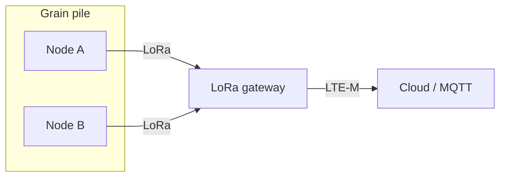

# Grain Sense — system design document

## 1. Purpose

This document describes a **reference architecture** for disposable, battery-powered grain pile environmental monitors. Each node measures temperature and relative humidity (RH) every **12 hours**, reports over **LoRa / Sub-GHz** to a site gateway, and the gateway forwards aggregated telemetry to the cloud over **cellular backhaul**.

The design targets **≥ 2 years** service life on a primary lithium cell under stated duty cycle assumptions (see `power_budget.md`).

## 2. System context

Adjacent warehouses may operate independent gateways on the same or overlapping channel plans. **Provisioning** binds each physical node to `(warehouse_id, gateway_id)` so the gateway can reject foreign or mis-routed packets (demonstrated in `gateway_simulator/`).

## 3. Node architecture

| Block            | Role |
|------------------|------|
| MCU + radio      | STM32WL class SoC: application + Sub-GHz radio in single package reduces BOM and sleep leakage paths versus discrete MCU + transceiver in aggressive cost targets. |
| Sensor           | SHT4x digital RH/T — calibrated, low drift, I²C for short on-time during sample bursts. |
| Power            | Primary Li-SOCl₂ or Li-MnO₂ bobbin cell (3.6 V / 3.0 V nominal); LDO or buck optimized for µA quiescent; bulk capacitance for LoRa TX pulse loads. |
| Mechanical       | Hermetic vented enclosure for RH equilibrium; IP rating vs cost tradeoff for buried deployment. |

### 3.1 Firmware responsibilities

- **Timebase:** RTC calendar or wakeup timer for 12 h cadence; compensate drift in gateway if needed.  
- **Measurement:** Power sensor VDD only around I²C transaction; validate ranges; set fault flags.  
- **Transmit:** Compose fixed binary frame; LoRa TX with confirmed vs unconfirmed policy (assignment assumes **unconfirmed** for battery, with limited retries).  
- **Persistence:** Sequence counter and retry state in backup registers or FRAM if product tier requires (reference code uses RTC backup domain abstraction).  
- **Security (stretch):** Per-unit MIC keys in a production system; out of scope for this assignment binary except CRC integrity.

## 4. Gateway architecture

- Multi-channel LoRa concentrator or STM32WL-based gateway reference.  
- **Packet filtering:** CRC, roster, `warehouse_id`, and `gateway_id` match before uplink to cloud.  
- **Backhaul:** LTE-M / NB-IoT modem; MQTT or HTTPS JSON translation (simulator logs CSV for grading).

## 5. Design tradeoffs (interview talking points)

| Topic | Choice | Rationale |
|-------|--------|-----------|
| 12 h sample period | Fixed long interval | Grain thermal mass is slow; minimizes self-heating and average current. |
| Unconfirmed TX | Default | Confirmed downlink would dominate energy unless Class B/C used. |
| Disposable node | No field service | Sealed unit; 2-year life aligns with campaign economics; no USB debug in production. |
| CRC16 only on air | Lightweight | Strong integrity vs random errors; **not** authentication — keys would be required for anti-spoofing. |
| STM32WL | Integrated | Fewer SPI lines active during sleep; simpler PCB for buried puck form factor. |

## 6. References

- `protocol/packet_format.md` — byte-level layout.  
- `docs/power_budget.md` — energy accounting.  
- `docs/protocol_design.md` — LoRa parameter discussion.  
- `docs/bom.md` — indicative bill of materials.
